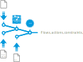

As the generation and demand mix evolves, distributed generation may exceed local demand more and more frequently while offshore wind and areas with high solar generation levels create new power flow patterns on the transmission network. New constraints may be reached. Demand, generation and transmission capacities (monitored by dynamic line rating solutions) will be strongly correlated to climate.   

In this evolving context, new planning methods and tools have to be implemented to reach the objective of a reliable, sustainable and cost effective system. A key objective of this tool is to evaluate the security of supply of future networks situtations, building from weather correlated demand, generation and transmission capacities. This user story presents such a tool, used by TSO's to enlarge the network planner toolbox. We are going to explain how to perform a network planning tool using PowSyBl and some specific developments.

The purpose of grid planning is to ensure that the network is well dimensioned in future situations (considering for instance weather hazard, consumption evolution, loss of grid equipment, etc.) and to find some operational solution (as changing the grid scheme) or when it’s necessary an investment solution (as grid reinforcement). Grid situations are described through time series, which can be for instance:
-	A forecast of the demand related to several hypothesis,
-	A renewable generation modelled with weather forecasting,
-	With a more short-term approach: the list of all disconnected elements.
This tool is able to launch loadflow computation on each situation defined and optimize the grid operating scheme through actions on the network (as changing switch position or transformer taps) minimizing costs and avoiding contraints. This type of computation is also called Optimal Powerflow (OPF).

# Workflow

First, the network case file is imported. Several input formats are supported to model the network: CIM-CGMES, UCTE or IIDM. Load, wind power generation, solar power generation, nuclear powr generation, etc. are stored in time series and imported in the framework in order to build many situations. In this user story, the time series are producted by the open source probabilistic software Antares (https://antares-simulator.org/). Antares optimizes the unit-commitment and dispatch so as to meet the demand at the lowest cost, given the load, the wind power generation, the solar power generation, the hydraulic inflows and the thermal availibility.

Secondly, time series are mapped to the network. The mapping is the key step to downscale time series into network injections. It is done thanks to a ```groovy``` script by the network planner.

Then, for each time step and for each listed contingency, an OPF is computed in order to optimize the grid operations. Here the OPF used is the open source simulator Metrix.

Finally, the results provided by the OPF are post-processed to build aggregated indicators for the end user.

{: width="100%" .center-image}
