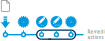

This user story concerns Transmission System Operators (TSOs). They ensure transport grid safety and security of supply, humans and equipments at every moment. The transport grid is full of equipements such as lines, generating units, bar sections, power transformers, etc. The loss of a single equipement is called a contingency. The transport network can met some contingencies (for example, the loss of a 400 kV line), which can lead to exploitation limits violation (example, lines aound the contingency can be overloaded). A TSO knows, at every moment, how to absorb limit violations: operators look for remedial actions.

The grid exploitation follows the N-1 criterion: it is the basic principle of N-1 security in network planning states that if a component should fail or be shut down in a network operating at the maximum forecast levels of transmission and supply, the network security must still be guaranteed.

We are going to explain how to perform a security analysis using PowSyBl and some specific developments. The software simulates several equipment losses and ensure that all predefined remedial actions are efficient in maintaining grid safety. If limit violations remain, the software alerts operators to propose new remedial actions to the database. In the database, the remedial actions can be described by their cost or their efficiency, and priority is given to cost or efficiency according to the context.

# Workflow

The first input data of this process is the network model, coming from XIIDM format. We also need an way to define the security domain of the network: the contingency list, the remedial actions (given by the operator or by the database). Here we use a domain specific language dedicated to explicit contingencies and actions, available in the Powsybl framework.

In a first step, we perform a security analysis wich simulates all the contingencies of the network with the classic remedial actions available in the database. For remaining constraints, we simulate anew the contingency with operator-given remedial actions with a loadflow, until the network becomes safe again.

The output is a set of remedial actions. This workflow is performed for every moment of the day and at every forecast level.

As this software is used for the national transmission network and simulates the respect of the N-1 criterion, a single workflow analyses more that a thousand of contingencies. The computation time is then a big issue: thos software uses the HPC features of the framework PowSyBl (here the Slurm solution).

All PowSyBl features used in this workflow are described below with some implementation examples.

{: width="100%" .center-image}

# Identification of the power system blocks

This user story involves several features from PowSyBl framework and some other features that are specific:


The network is modeled in [IIDM](../iidm/model/index.md), which is the internal model of PowSyBl. This model can be serialized in a XML format. The network descriptioncan also be provided in a standard exchange format as CIM-CGMES or UCTE.
```java
File file = new File("/path/to/file/eurostag-tutorial1-lf.xml");
```

<br />

The file is imported through a gateway that converts the file in a in-memory model.
```java
Network network = Importers.loadNetwork(file.toString());
```

<br />

The big security analysis ! A security analysis needs an input variant, a set of parameters as a `securityAnalysisParameters` object and a set of contingencies as a `contingenciesProvider` object. In this user story, the simulator is Hades2 but could be an other load flow simulator, as the API interface contract is respected. For more details, please visit this [page](https://rte-france.github.io/hades2/features/loadflow.html) to learn about Hades2.

```java
SecurityAnalysis securityAnalysis = new Hades2SecurityAnalysisFactory().create(networkBe, computationManager, 0);
SecurityAnalysisParameters securityAnalysisParameters = new SecurityAnalysisParameters(); // Default parameters.
network.getVariantManager().cloneVariant(VariantManagerConstants.INITIAL_VARIANT_ID, "saVariant");
SecurityAnalysisResult securityAnalysisResult = securityAnalysis.run("saVariant", securityAnalysisParameters, contingenciesProvider).join();
```

<br />

The remaing unresolved contingencies.
Remedial actions given by the operator is converted in actions understandable by PowSyBl framework.
```java
// TODO
```

<br />
// TODO
The Application File System feature (AFS) is used for data management, and especially the feature of access to the remote data as the workflow involves several information systems.


# External features

The software provides a graphical interface to operators. There is a timeline and for each timestep they can see if it remains constraints and which remedial actions could resolved it or not. Operators can approved the remedial actions or suggest other remedial actions. Note that the security table is a small part of the exploitation information. We use an hypervision tool to present the results called [OperatorFabric](https://opfab.github.io/whatisopfab/).
